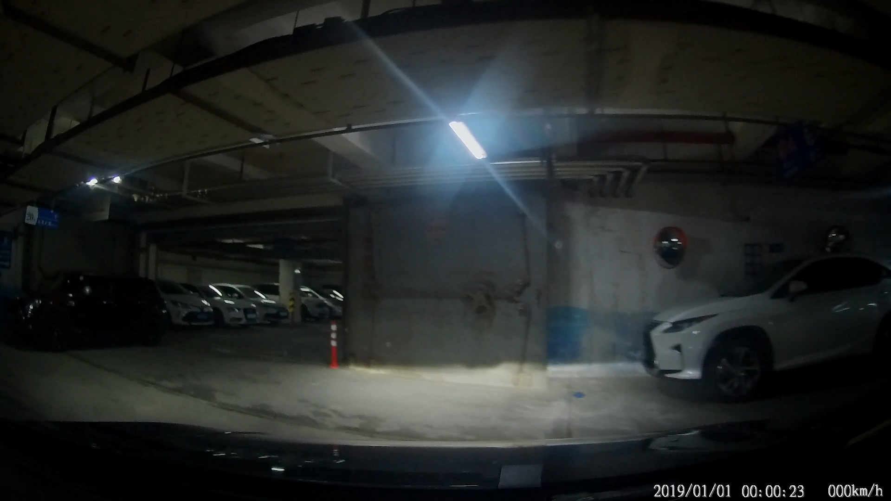
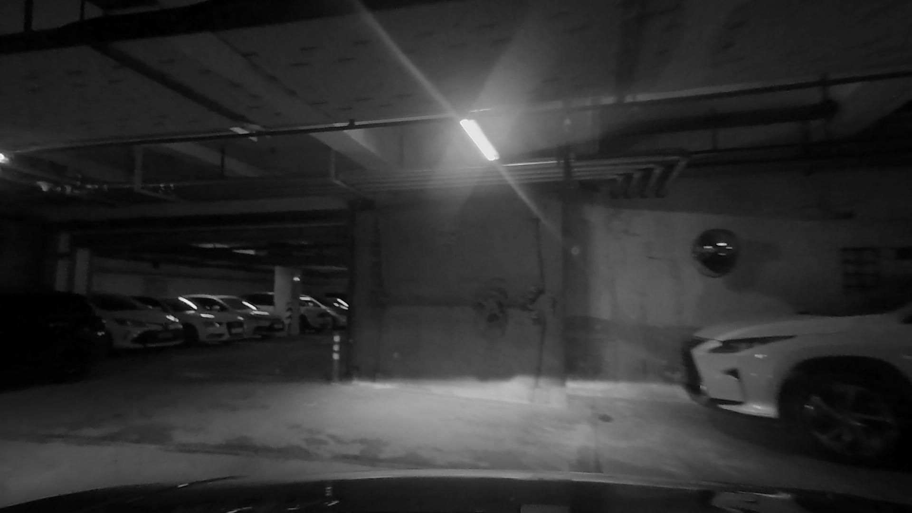

# 超广角（鱼眼）相机图像去畸变

author:cuixingxing

date: 2022.6

## OverView

由相机厂商提供的相机参数映射表对畸变图像做矫正，根据鱼眼镜头成像原理，分别采用3种方法（原理上逐个像素直接进行查表/插值，非网格数据插值，间接插值映射）进行实验对比，对矫正后的图提供[“same”、"valid"、"full"](https://www.mathworks.com/help/vision/ref/undistortfisheyeimage.html?s_tid=doc_ta#d126e333899)三个可选项输出。另外关于此鱼眼图像畸变表格理论矫正分析请移步到我的此[repo](https://github.com/cuixing158/OpenCVFisheyeAndDistortionTable)。

## 图像去畸变Result

- 鱼眼原始图： 

  

- 矫正图（“same”模式，与原始图大小一致）： 

  

- 矫正图（“valid”模式，只取有效像素图像）： 

  

- 矫正图（“full”模式，包含原始图像所有像素）： 

  

*If you would like to test more video data from the images, [click here](https://github.com/cuixing158/FishEyeImage_Undistortion/releases/download/v1.0.0/NOR_20160101_010852. MP4) to download the raw distortion data.*
## References

1. [常用相机投影及畸变模型（针孔|广角|鱼眼）](https://blog.csdn.net/qq_28087491/article/details/107965151)
1. [鱼眼镜头的成像原理到畸变矫正（完整版）](https://blog.csdn.net/qq_16137569/article/details/112398976)
